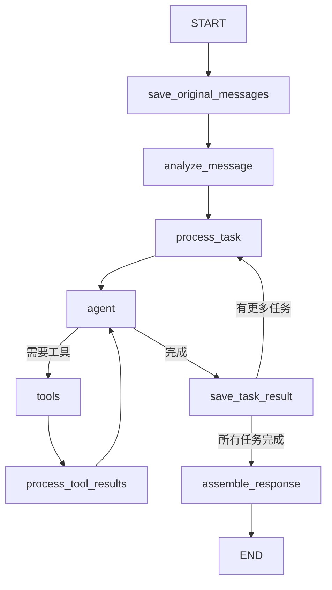

# 图结构实现文档

## 概述

本文档详细说明了基于 LangGraph 实现的异步任务处理图结构系统。该系统能够将用户的复杂查询拆分为多个子任务，并通过图结构进行并行处理，最终组装成完整的响应。

## 核心组件

### 状态管理

系统使用 `State` 类型来管理状态，包含以下关键信息：
- messages: 消息历史
- tasks: 拆分后的任务列表
- current_task_index: 当前处理的任务索引
- task_results: 任务处理结果
- tool_invocations: 工具调用计数器

### 主要节点

1. **analyze_message**
   - 功能：分析用户输入，将复杂查询拆分为多个独立任务
   - 实现：使用标点符号（问号、逗号、句号）作为分隔符
   - 输出：更新后的状态，包含任务列表

2. **process_task**
   - 功能：准备单个任务的处理环境
   - 实现：从任务列表中提取当前任务
   - 输出：包含单个任务的消息列表

3. **call_model**
   - 功能：调用大语言模型处理任务
   - 实现：绑定工具并处理用户查询
   - 输出：模型响应或工具调用请求

4. **tool_node**
   - 功能：执行具体的工具调用
   - 工具类型：
     - get_current_weather: 获取天气信息
     - get_current_time: 获取当前时间

5. **save_task_result**
   - 功能：保存任务处理结果
   - 实现：收集 AI 响应和工具调用结果
   - 输出：更新后的任务结果列表

6. **assemble_response**
   - 功能：组装最终响应
   - 实现：整合所有任务的处理结果
   - 输出：格式化的综合响应

## 工作流程



## 关键流程控制

### 1. 任务流转控制

```python
def has_more_tasks(state: State) -> Literal["process_next_task", "assemble_response"]:
    tasks = state.get('tasks', [])
    current_index = state.get('current_task_index', 0)
    
    if current_index < len(tasks):
        return "process_next_task"
    else:
        return "assemble_response"
```

### 2. 工具调用控制

```python
def should_continue(state: State) -> Literal["tools", END]:
    # 最多允许5次工具调用
    if tool_invocations >= 5:
        return END
    
    # 检查是否需要工具调用
    if isinstance(last_message, AIMessage) and hasattr(last_message, "tool_calls"):
        return "tools"
    
    return END
```

## 错误处理

1. **工具调用限制**
   - 每个任务最多允许 5 次工具调用
   - 防止无限循环和资源耗尽

2. **状态验证**
   - 每个节点都会验证必要的状态字段
   - 确保数据完整性和处理流程的正确性

## 使用示例

```python
# 创建工作流实例
workflow = StateGraph(State)

# 初始化查询
result = await parallelWorkflow.ainvoke({
    "messages": [
        HumanMessage(content="查询示例消息"),
    ]
})

# 获取响应
response = result.get("messages")[-1].content
```

## 扩展建议

1. **任务分析增强**
   - 实现更智能的任务拆分逻辑
   - 添加任务优先级管理

2. **工具集成**
   - 扩展更多工具类型
   - 实现工具调用结果缓存

3. **错误恢复**
   - 添加任务重试机制
   - 实现部分失败的优雅降级

4. **监控与日志**
   - 添加详细的执行日志
   - 实现性能监控指标

## 注意事项

1. 确保工具调用的幂等性
2. 注意状态管理的线程安全
3. 合理控制并发任务数量
4. 定期清理历史状态数据

## 依赖要求

- Python 3.x
- langgraph
- langchain_core
- pydantic
- typing_extensions 